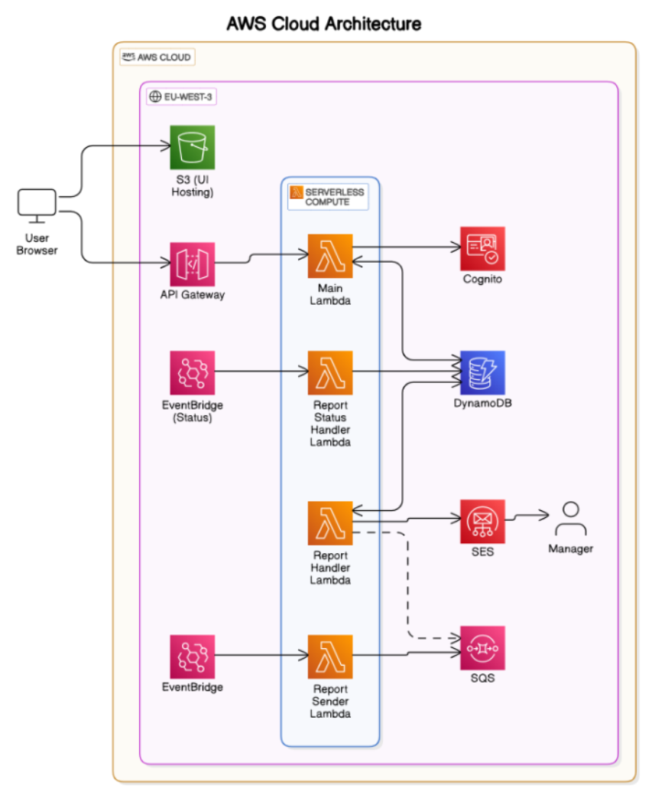
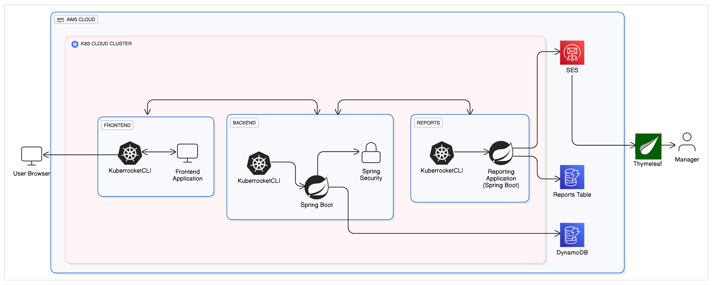

# 🌱 Green and Tasty - Scalable Restaurant Management Platform

**Green and Tasty** is a full-featured, cloud-native restaurant booking and management system designed to automate workflows, optimize staff allocation, and improve customer experiences across multiple restaurant locations. What began as an AWS serverless system is now evolving into a containerized, microservices-driven architecture running on Kubernetes with GitOps integration.

---

## 🚀 Key Highlights

- 📦 Migrated from AWS Lambda-based monolith to **Kubernetes-based microservices**
- 🔄 CI/CD powered by **KubeRocketCI** and **ArgoCD** for GitOps-driven deployments
- 🧠 Designed using solid **System Design principles** with real-world implementation
- 💡 Modular architecture: Auth, Reservation, Feedback, Reporting, Menu, Users
- 🌍 Frontend (React) and Reporting Service now running in isolated pods behind Ingress

---

## 🛠️ Tech Stack

**Languages & Frameworks:**  
Java, Spring Boot, Spring Security, Dagger, React.js

**Cloud & Infrastructure:**  
AWS (Lambda, API Gateway, S3, SES, SQS, DynamoDB), Kubernetes, GitLab CI, KubeRocketCI, ArgoCD, Ingress Controller

**Databases:**  
DynamoDB → Migrated to MongoDB

**Authentication:**  
Cognito → Migrated to Spring Security with JWT

---

## 📐 Architecture Overview

Originally built on AWS using Lambda, API Gateway, and Cognito for fast prototyping and cost efficiency, the platform has now transitioned to a scalable Kubernetes environment. Each core component — authentication, reservation, reporting, feedback, etc. — runs as an isolated microservice within Kubernetes pods, managed by ArgoCD and exposed via Ingress for seamless internal and external routing.

Reporting service generates scheduled CSV reports from MongoDB using Spring’s `@Scheduled(cron)` and delivers them to managers via AWS SES.

---

## 🔑 Features

- 🔐 **Spring Security-based Auth System** (replacing Cognito)
- 🧾 **Smart Table Reservation** with 90-min slot + 15-min buffer logic
- 🤖 **Workload-based Waiter Assignment** to prevent imbalance
- ✨ **Dynamic Feedback System** – food & service rated independently
- 🗃️ **MongoDB-backed reporting service** with cron-based SES mail triggers
- 📦 **Pre-order system** for waiters and customers
- 📈 **Real-time analytics engine** tracking user experience & operational KPIs
- 📋 **Role-based Dashboards** for Customer, Waiter, and Visitor access
- 🌐 **Ingress-based routing** for scalable pod communication

---

## 🔄 Recent Enhancements

- ✅ Migrated Authentication from **Cognito → Spring Security**
- ✅ Migrated Database from **DynamoDB → MongoDB**
- ✅ Deployed core services into **Kubernetes Pods**
- ✅ Implemented **Ingress** for load balancing and routing
- ✅ Added **Scheduled Reporting Service** with SES + CSV export
- ✅ CI/CD Pipeline built with **KubeRocketCI** and GitOps with **ArgoCD**

---
## 📐 Component Diagram: Before and After Migration

### **Before Migration**


### **After Migration**


## 📊 Future Enhancements

- 📱 Native mobile app with push notifications & location-based features  
- 🧠 AI-based reservation suggestions & dynamic pricing  
- 💳 Integration with payment gateways & loyalty systems  
- 🌍 Multi-language and multi-currency support  
- 📈 Advanced dashboards for behavior and sales analytics  
- 🌱 Sustainability insights: food waste & energy monitoring

---

## 📁 Project Structure

```bash
├── restaurant-api/
├── reporting-service/         # Uses cron to email reports via SES
├── k8s/                       # Deployment YAMLs for all services
├── .gitlab-ci.yml             # KubeRocketCI pipeline
└── README.md
